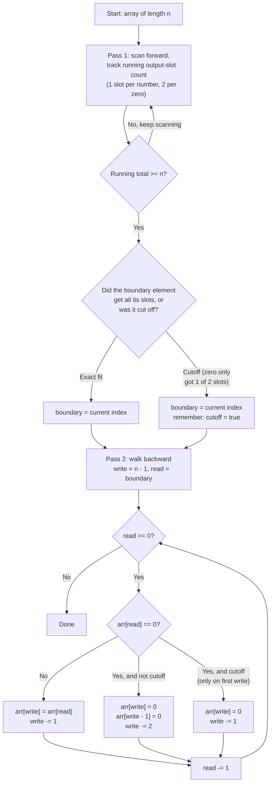
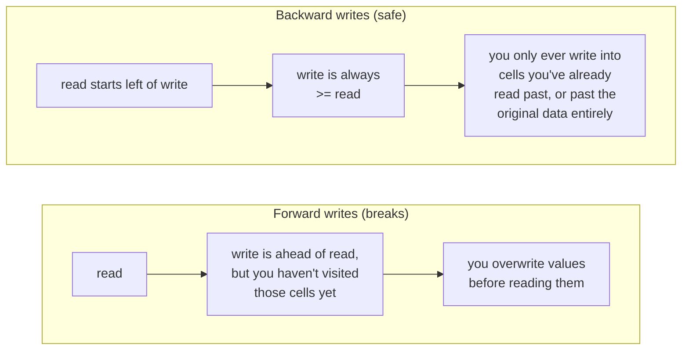

# Duplicate Zeros — O(n) Two-Pointer Approach

This is a study aid for the in-place, O(n) time / O(1) space solution to
[Duplicate Zeros](./readme.md). It's pseudocode + diagrams, not a copy-paste
answer — the goal is to understand the mechanics well enough to write the
Ruby yourself.

## Why the naive shift-in-place is O(n²)

Inserting a zero and shifting everything after it right by one is correct,
but each shift touches up to n elements, and you may do that for every zero
in the array. Worst case (array of all zeros): O(n) shifts × O(n) cost each
= O(n²).

The O(n) trick avoids ever shifting more than once, by figuring out ahead of
time exactly which elements survive truncation, then writing the final
array from the back.

## Algorithm overview

## Why walk backward in pass 2, not forward?

Since duplicating a zero always pushes data *rightward*, the write pointer
is always at or ahead of the read pointer. Walking backward guarantees you
finish reading a cell's original value before anything gets written into
it.

## Pass 1 traced on `[8, 4, 5, 0, 0, 0, 0, 7]` (length 8)

| index | value | slots needed | running total | note |
|---|---|---|---|---|
| 0 | 8 | 1 | 1 | |
| 1 | 4 | 1 | 2 | |
| 2 | 5 | 1 | 3 | |
| 3 | 0 | 2 | 5 | |
| 4 | 0 | 2 | 7 | |
| 5 | 0 | 2 | **9 → exceeds 8** | boundary! only 1 of 2 slots fits → **cutoff = true** |

Pass 1 stops at index 5. Indices 6 and 7 are never even inspected — they're
guaranteed to fall off the end.

## Pass 2 traced from the boundary backward

Starting state: `write = 7`, `read = 5`, `cutoff = true`.

| step | read | value at read | write(s) touched | cutoff still active? | write after | read after |
|---|---|---|---|---|---|---|
| 1 | 5 | 0 | `arr[7] = 0` (single slot — cutoff) | consumed, now false | 6 | 4 |
| 2 | 4 | 0 | `arr[6] = 0`, `arr[5] = 0` | n/a | 4 | 3 |
| 3 | 3 | 0 | `arr[4] = 0`, `arr[3] = 0` | n/a | 2 | 2 |
| 4 | 2 | 5 | `arr[2] = 5` | n/a | 1 | 1 |
| 5 | 1 | 4 | `arr[1] = 4` | n/a | 0 | 0 |
| 6 | 0 | 8 | `arr[0] = 8` | n/a | -1 | -1 (loop ends) |

Final array: `[8, 4, 5, 0, 0, 0, 0, 0]` — matches the expected output for
this case.

## Complexity

- **Time:** O(n) — pass 1 visits at most n elements, pass 2 visits at most
  n elements. Two linear passes, no nested shifting.
- **Space:** O(1) — only a handful of scalar variables (`read`, `write`,
  running total, `cutoff` flag). The array is mutated in place.

## Try it yourself

Trace the table above for `[1, 2, 3, 0]` (length 4) — where does pass 1
stop, and is it a cutoff or exact fit? Then trace `[1, 0, 2, 3, 0, 4, 5, 0]`
(length 8, no cutoff case) to see the exact-fit path through pass 2.
